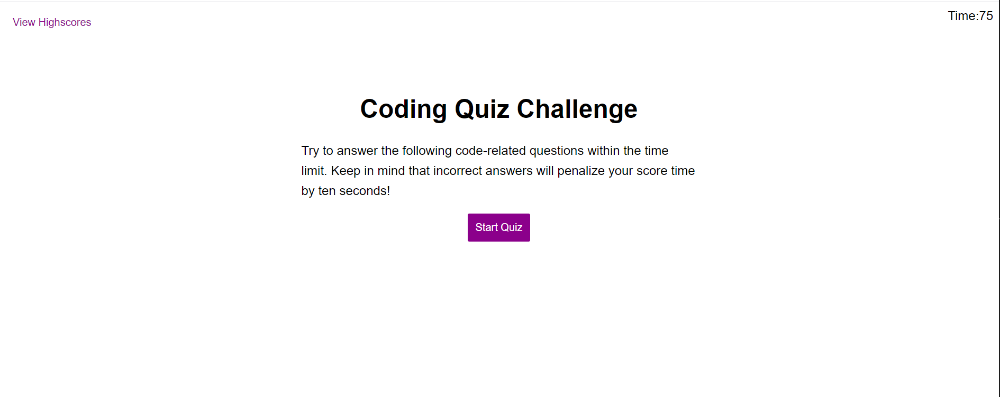
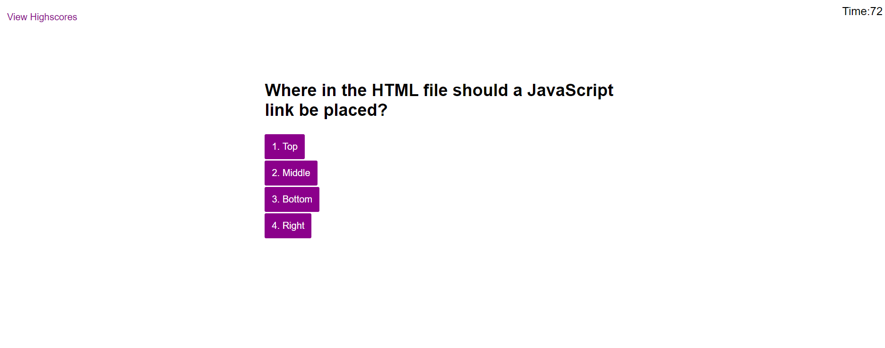
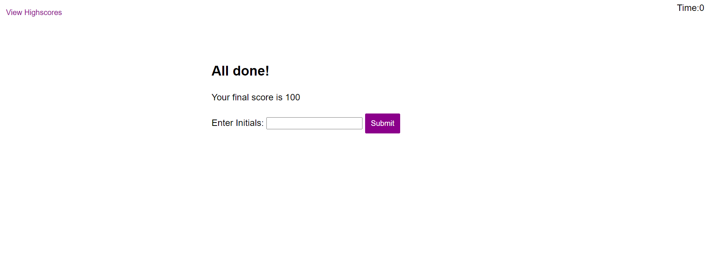
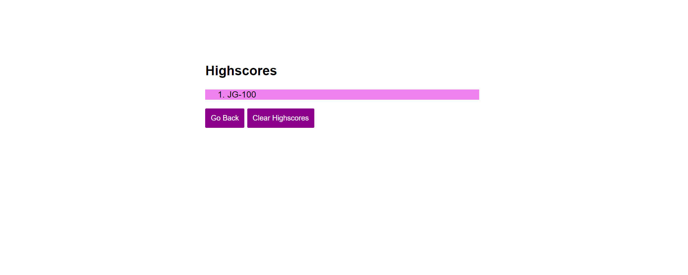

# Code-Quiz

This project involved creating a coding quiz. It required to create the initial page where the user can click start quiz to see the first question and to start a timer of 75 seconds.

After the user clicks start quiz, the timer starts counting down to zero and the user is presented with the first question and the available answers.

After ansering the first question, the user is presented with the second question and its available answers. If the user selects the correct answer, a correct answer message will display at the bottom of the second question for one second. If the user selects the wrong answer, the same message will appear for one second but it will display wrong instead.

Each question follows a similar patter depending on the response the user selects. If the user selects the wrong answer for a question, ten seconds are deducted from the timer and twenty points are deducted from the score. The user starts with a score of 100.

After the last question is answered, the user will be alerted that the quiz is done and will be shown the score. The user will also have a field to enter initials and a submit button.

After the user enters initials and clicks submit, the initials and score are saved in the browser. The user is also shown the highschores. The user can click clear highschores to delete the information or the user can click on the go back button. The go back button takes the user back to the initial page.

## URL

Here is a link to the live website:

https://chavalk.github.io/code-quiz/
